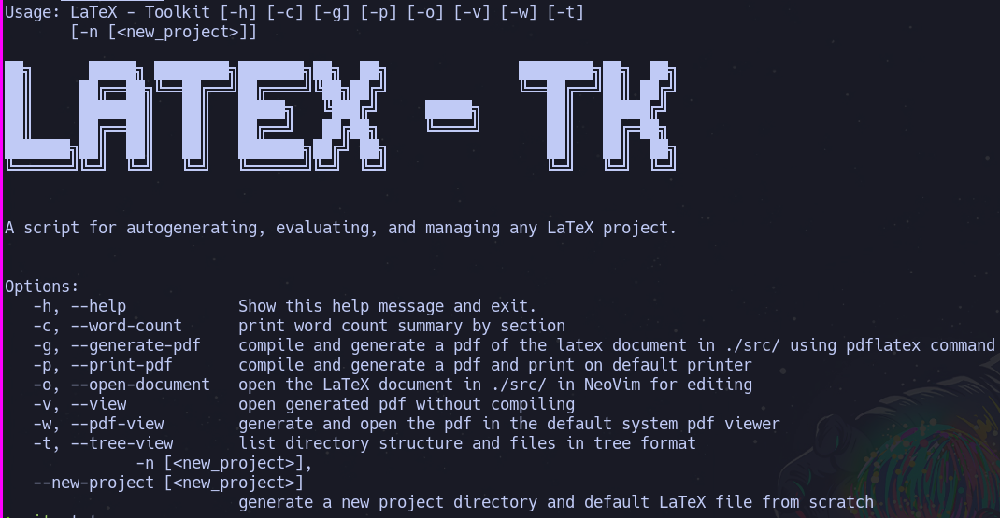

# LaTeX - Toolkit

This is a Lua script which can be used to manage and standardize the file structure of your LaTeX projects on the command line.

### Example Output



# Installation

Clone repository and run installation script with:

```bash
git clone https://github.com/grwells/latex-toolkit.git &&
./install.sh
```

Afterward, verify installation with:

```
$ ltk -h
# or
$ latextk -h
```

# Future Feature Ideas
1. Config file to pass startup commands to vim/neovim after startup. See [commands](https://neovim.io/doc/user/starting.html) documentation for passing commands to neovim from command line. Ex. `nvim "+set cc=80" <filename>`.

2. Project export as an archive/zipped archive. This would reduce file size, make more transportable with git directories, _etc._
