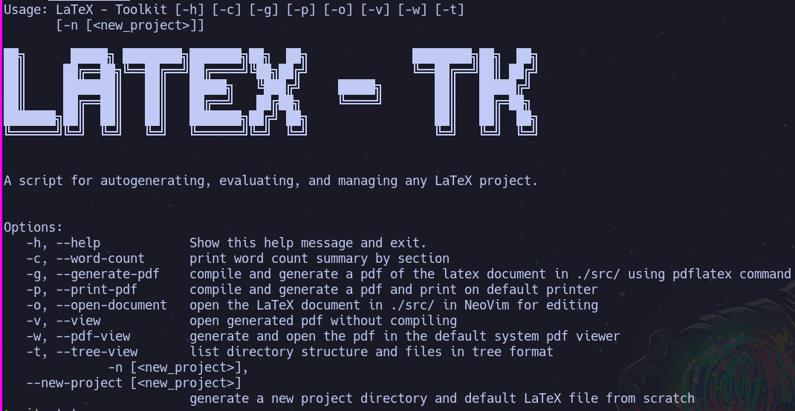

# LaTeX - Toolkit

This is a Lua script which can be used to manage and standardize the file structure of your LaTeX projects on the command line.

>[!note]
> Project notes on neovim tips and other helpful technical bits learned through this project: [notes](./project/notes.md)

### Example Output



# Dependencies
- [argparse](https://luarocks.org/modules/argparse/argparse) command line arguments parsing and other cool stuff.
- [LuaLogging](https://lunarmodules.github.io/lualogging/) API for logging in Lua.

### Installing with LuaRocks

```bash
# to install luarocks
sudo apt install luarocks 

luarocks install argparse lualogging
# or 
luarocks install --local argparse lualogging
```

# Installation

```bash
git clone https://github.com/grwells/latex-toolkit.git &&
./install.sh
```

Afterward, verify installation with:

```
$ ltk -h
# or
$ latextk -h
```

# Future Feature Ideas

- [ ] Project export as an archive/zipped archive. This would reduce file size, make more transportable with git directories, _etc._
- [ ] Option/Command/Argument Completion. LuaArgparse generates completion script, installing on system requires command name match... needs some fiddling.

